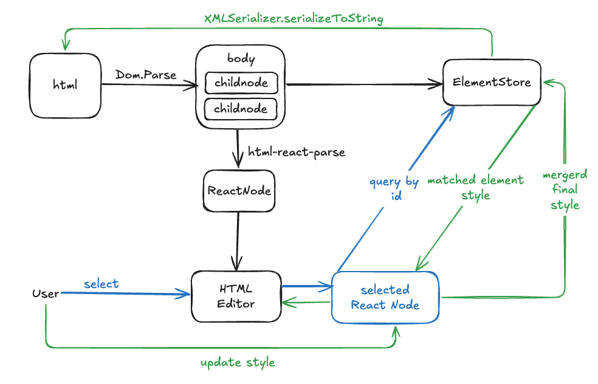

# React 如何渲染 AI 生成的 HTML 页面

## 背景

当我们的项目需要在软件内使用 AI 能力来生成一个静态页面时，此时如何在 React 中渲染好 HTML 页面成为了一个重要的问题，如何渲染、怎么修改、怎么更好的基于 AI 来进行二次编辑成为了最重要的问题，本篇主要是用来记录实现这一思路的过程以及解决方案。

## 前期准备

### 1. 获取 AI 生成的 HTML

当我们想要获取一个 AI 输出的 HTML, 那么很重要的一点便是首先准备好我们的提示词：

> 我们需要包含如下准则：
> 1. 便于渲染和针对单个元素的修改
> 2. 静态页面避免动画、过渡等复杂效果
> 3. 确保 AI 输出内容正确且方便我们操作


```md
你是一名高级前端开发工程师，专门负责H5页面开发。请根据以下需求生成一个完全静态的HTML页面。

需求：创建一个${具体的页面内容需求}，尺寸为480px（宽度）x 1840px（高度）。页面不得包含任何动画、过渡效果、JavaScript代码、注释代码。

输出要求：
1. **仅输出完整的HTML代码**，不包含任何额外解释或信息。代码必须正确且完整，使用```html代码块```格式输出。
2. HTML中严禁使用任何第三方CSS库或CSS类。所有样式必须以内联样式（style属性）编写。
3. 根元素的ID必须为“root-”开头（如root-container）。
4. 根元素使用相对定位（position: relative），其他所有元素使用绝对定位（position: absolute），并通过top和left属性精确指定位置，避免元素重叠，确保层级和位置正确。
5. 所有样式数值必须使用px单位（例如width: 100px;）。
6. 仅允许使用div、p、img标签。每个标签必须明确指定宽度（width）和高度（height）样式。
7. 禁止使用动画、过渡效果，以及overflow、float、flex等布局属性。
```

### 2. 做好 HTML 和 React ELement 的 Transform 技术方案调研

